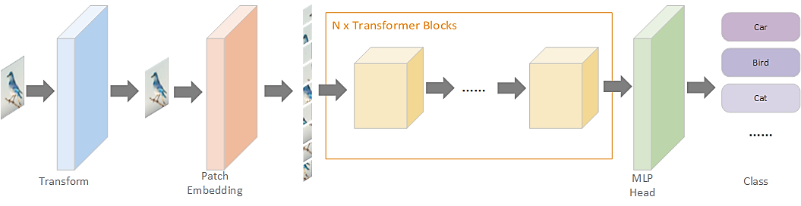

# Data & Channel efficient vision Transformer

### Abstract

In order to improve the accuracy of the ViT architecture in image recognition tasks, this paper proposes a Transformer-based DNN applied to image classifier called Data and Channel efficient vision Transformer network by extracting image channel information. Furthermore, a method to avoid over-fitting is proposed called Entropy Increase for information of image Edge and Noise Lay-over for information of image Edge in this paper. Through a series of experiments, this paper compares the accuracy of the model with ViT and the traditional convolutional neural network structures in the classification data set, and evaluates the effectiveness of the two image preprocessing algorithms on the model and the convolutional neural network model. It turns out that the accuracy of this model is about 2% higher than other ViT-based DNNs. 

### Author

[Yuyao Ge](https://github.com/GeYuYao-hub), [Lizhe Chen](https://github.com/574118090)

### Architecture of Data and Channel efficient vision Transformer.

 
  

### Diagram of DCT Transformer Encoder

 
  

### Compared with other architecture
 
  
